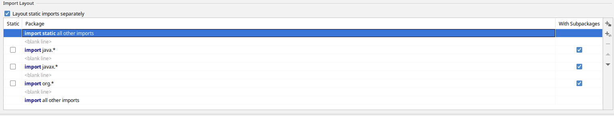

:sectnums:

= java-dev-tools

== Általános

A projekt célja azon eszközök összefogása, mely a java fejlesztésekben segítséget nyújt.

== Projekt felépítése

* `/codeformatter` - Ebben a mappában találhatók a céges kód formatter xml-ek Eclipse idehez.

== Code formatter

NOTE: IntelliJ idea használathoz, létezik egy plugin ami tudja használni az Eclipse formattert: https://plugins.jetbrains.com/plugin/6546-eclipse-code-formatter

.Formatter fájlról
A fájl eredetileg az Eclipse beépített beállításaiból keletkezik, pár változással.

.Formatter eltérések a default Eclipse-től
A változásokat úgy a legegyszerűbb meglátni, hogy az Eclipse-n belül létrehozunk egy új formatter-t ami az Eclipse default-jából indul ki, és kiexportáljuk. Megfogjuk a saját formaterünket, ami akár régebbi Eclipse verzión keletkezett, importáljuk majd exportáljuk. Ilyenkor a régebbi formatter kiegészül az Eclipse-ben beiktatott újabb szabályokkal.

.Eltérések
[cols="1,1,1,1,1"]
|===
| Beállítás azonosítója | Alapértelmezett érték | Használt érték | Verzió fájl-tól| Magyarázat
| org.eclipse.jdt.core.formatter.comment.insert_new_line_for_parameter | do not insert | insert | v15 | ?
| org.eclipse.jdt.core.formatter.comment.indent_root_tags | false | true | v15 | ?
| org.eclipse.jdt.core.formatter.comment.count_line_length_from_starting_position | true | false | v15 | ?
| org.eclipse.jdt.core.formatter.insert_new_line_at_end_of_file_if_missing | do not insert | insert | v15 | Minden fájlt végére rakjon egy üres sort (számos problémát megold)
| org.eclipse.jdt.core.formatter.format_line_comment_starting_on_first_column | false | true | v15 | ?
| org.eclipse.jdt.core.formatter.alignment_for_annotations_on_enum_constant | 49(*1) | 0 | v15 | ?
| org.eclipse.jdt.core.formatter.alignment_for_enum_constants | 16 (*1) | 0 | v15 | ?
| org.eclipse.jdt.core.formatter.comment.align_tags_descriptions_grouped | true | false | v15 | ?
| org.eclipse.jdt.core.formatter.comment.line_length | 80 | 150 | v15 | 150 karakter sor tördelés kommentekre
| org.eclipse.jdt.core.formatter.use_on_off_tags | true | false | v15 | Ne lehessen kapcsolgatni a kódban a formattert
| org.eclipse.jdt.core.formatter.insert_space_after_closing_angle_bracket_in_type_arguments | do not insert | insert | v15 | ?
| org.eclipse.jdt.core.formatter.alignment_for_assertion_message | 16 (*1) | 0 | v15 | ?
| org.eclipse.jdt.core.formatter.comment.indent_parameter_description | false | true | v15 | ?
| org.eclipse.jdt.core.formatter.tabulation.char | tab | space | v15 | Tabulátor 4 space-el helyettesíti
| org.eclipse.jdt.core.formatter.lineSplit | 120 | 150 | v15 | 150 karakter sor tördelés
| org.eclipse.jdt.core.formatter.alignment_for_arguments_in_annotation | 0 (*1) | 16 | v16 | Az annotaciók tördelése nem jól történt, konkrétan ki van default kapcsolva
| org.eclipse.jdt.core.formatter.alignment_for_selector_in_method_invocation | 16 | 80 | 0.2.0 | A láncolt metódus hívások (fluent api) metódusonként új sorba kerüljeneknek, ha túllépnék a megengedett maximális sorméretet.
| org.eclipse.jdt.core.formatter.align_selector_in_method_invocation_on_expression_first_line | - | true | 0.2.0 | A láncolt metódus hívások (fluent api) metódusonként új sorba kerüljeneknek, ha túllépnék a megengedett maximális sorméretet.
| org.eclipse.jdt.core.formatter.alignment_for_arguments_in_explicit_constructor_call | 16 | 48 | 0.2.0 | Paraméter felsorolások új sorba kerüljeneknek, ha túllépnék a megengedett maximális sorméretet.
| org.eclipse.jdt.core.formatter.alignment_for_arguments_in_allocation_expression | 16 | 48 | 0.2.0 | Paraméter felsorolások új sorba kerüljeneknek, ha túllépnék a megengedett maximális sorméretet.
| org.eclipse.jdt.core.formatter.alignment_for_arguments_in_method_invocation | 16 | 48 | 0.2.0 | Paraméter felsorolások új sorba kerüljeneknek, ha túllépnék a megengedett maximális sorméretet.
| org.eclipse.jdt.core.formatter.alignment_for_arguments_in_qualified_allocation_expression | 16 | 48 | 0.2.0 | Paraméter felsorolások új sorba kerüljeneknek, ha túllépnék a megengedett maximális sorméretet.
|===

.XML alapú forrás fájlok formázása
1. Tab <-> 4 space
2. "Tab"-ot használunk a tördelésnél
3. Sor hossza max 150 karakter
4. Default namespace rövidítés: xsd

== IntelliJ IDEA-ban eclipse code formatter beállítása

1) File menü /Settings...  Plugins (tipp a bal odali fa feletti keresőmezőben gépelve szűrődik a bal odali fa):

image::docs/images/plugins.png[]

2) A fában a "Plugins"-ra kattintás után a jobb oldalon megjelenik a "Marketplace". Kezdjük el a jobb oldali keresőben gépelni az "Eclipse Code Formatter"-t és telepítsük fel.

3) Töltsük le akódformázási szabályokat, amit itt a repoban meg lehet találni a /codeformatter/eclipse mappában.

4) Bal oldali fa fölött kezdjük el gépelni "Eclipse Code Formatter". Válasszuk ki. Majd jobb oldalon valahogy így kellene kinéznie a beállításoknak (verzió függő és helyi gép függő):

image::docs/images/Eclipse-Code-Formatter.png[]

5)   "*" imports mellőzése:

Settings > Editor > Code Style > Java > Imports > Class count to use import with '' -> 100

Settings > Editor > Code Style > Java > Imports > Names count to use static import with '' -> 100

6) Tipp: Amivel összeakad: A "Settings > Editor > General > Auto Import > Optimize imports on the fly" beállítás. Ez összeakad az Eclipse Code Formatter-el, így az importokat 2x formázta, utoljára az IDEA sajátja.

Ezért ha az autoimportot használjuk, akkor Settings > Editor > Code Style > Java Imports > Import layout részt így állítsuk be: import static all other imports; blank line; import java.*; blank line; import javax.*; blank line; import jakarta.*; blank line; import org.*; blank line; import all other

Hasonlóan mint az alábbi ábrán (csak ott a jakarta hiányzik).

Amikor egy régi kódot módosítunk, akkor lehet vegyes a tab / space egy soron. Ezért érdemes bekapcsolni, hogy lássuk a whiteSpace-kat is:

image::docs/images/image2020-10-30_12-38-59.png[]

Copyright (C) 2023 i-Cell Mobilsoft Zrt.
